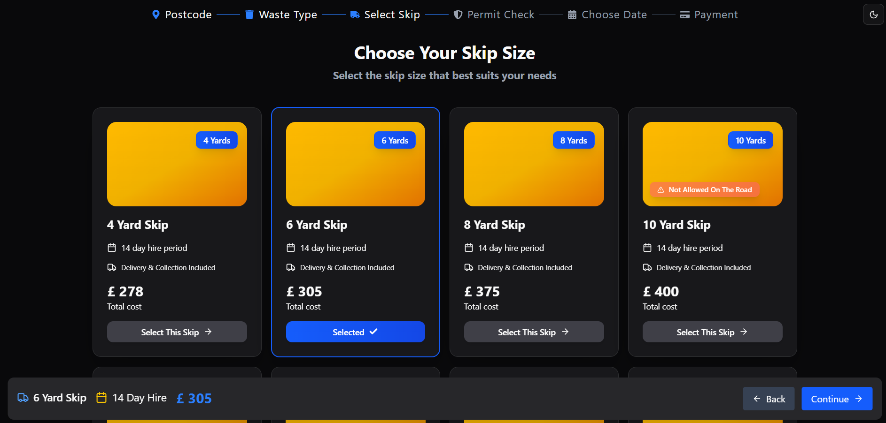

# 🚀 React + TypeScript Case Study

This project is a case study developed using **React** and **TypeScript**. It demonstrates a modular and modern frontend architecture with responsive design, theme support, and clean state management.

---
## 📸 App Screenshot

## 🛠️ Tech Stack

### ⚛️ Core
- **React**
- **TypeScript**

### 🧠 State Management
- Built using **React's Context API**.

### 🎨 UI Libraries
- **Shadcn UI**
- **Material UI (MUI)**

### 🖼️ Icons
- **react-icons**
- **lucide-react**

### 💅 Styling
- **Tailwind CSS**

### 🌗 Theme
- Light/Dark mode support with **ThemeProvider** pattern.

---

## 📂 Folder Structure

src/
├── components/ # Reusable UI components
├── context/ # Global state providers (useContext)
├── layout/ # Layout components (e.g. sidebar, header)
├── pages/ # Main views/pages
├── styles/ # Global styles & Tailwind configuration
├── types/ # TypeScript interfaces and types
└── App.tsx

## ⚙️ Getting Started

git clone https://github.com/mcemalciftci/select-skip-app.git
cd select-skip-app
npm install
npm run dev
